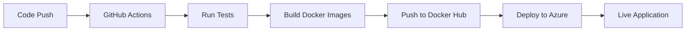

# 🚀 Deployment Setup Guide

## Prerequisites

1. **Docker Hub Account**: Create account at https://hub.docker.com
2. **Azure Account**: Create account at https://azure.microsoft.com
3. **GitHub Repository**: Your code should be in a GitHub repository

## Step 1: Configure GitHub Secrets

Go to your GitHub repository → Settings → Secrets and variables → Actions

### Required Secrets:

#### **Docker Hub Secrets:**
```
DOCKER_USERNAME = kumarharsh001
DOCKER_PASSWORD = your_docker_hub_password_or_token
```

#### **Azure Secrets (for later):**
```
AZURE_CLIENT_ID = your_azure_client_id
AZURE_CLIENT_SECRET = your_azure_client_secret
AZURE_SUBSCRIPTION_ID = your_azure_subscription_id
AZURE_TENANT_ID = your_azure_tenant_id
```

## Step 2: Docker Hub Setup

1. **Login to Docker Hub**
2. **Create Repository** (if not exists):
   - Repository name: `attendoo`
   - Visibility: Public (or Private if you prefer)

3. **Generate Access Token** (Recommended over password):
   - Go to Account Settings → Security → Access Tokens
   - Create new token with Read/Write permissions
   - Use this token as `DOCKER_PASSWORD` in GitHub secrets

## Step 3: Test Docker Build Locally

Before pushing to GitHub, test locally:

```bash
# Build backend image
docker build -t kumarharsh001/attendoo:backend-test ./backend

# Build frontend image  
docker build -t kumarharsh001/attendoo:frontend-test ./frontend

# Test run locally
docker-compose up --build
```

## Step 4: Trigger CI/CD Pipeline

1. **Commit and push to master branch**:
   ```bash
   git add .
   git commit -m "Add Docker build and push to CI/CD"
   git push origin master
   ```

2. **Monitor GitHub Actions**:
   - Go to your repository → Actions tab
   - Watch the workflow run
   - Check for any errors

## Step 5: Verify Docker Images

After successful pipeline run:

1. **Check Docker Hub**: https://hub.docker.com/r/kumarharsh001/attendoo
2. **Verify tags**:
   - `backend-latest`
   - `frontend-latest`
   - `backend-<commit-sha>`
   - `frontend-<commit-sha>`

## Step 6: Azure Deployment (Next Phase)

Once Docker images are successfully pushed, we'll configure:

1. **Azure Container Instances** or **Azure Container Apps**
2. **Azure CLI authentication**
3. **Environment variables for production**
4. **Custom domain and SSL**

## Workflow Overview



## Troubleshooting

### Common Issues:

1. **Docker login fails**: Check DOCKER_USERNAME and DOCKER_PASSWORD secrets
2. **Build fails**: Check Dockerfile syntax and dependencies
3. **Push fails**: Verify Docker Hub repository exists and permissions
4. **Tests fail**: Check MongoDB Atlas connection and environment variables

### Debug Commands:

```bash
# Check Docker Hub login
docker login

# Test build locally
docker build --no-cache -t test-image ./backend

# Check running containers
docker ps

# View logs
docker logs container-name
```

## Next Steps

1. ✅ Set up GitHub secrets
2. ✅ Test local Docker build
3. ✅ Push to trigger CI/CD
4. ✅ Verify Docker Hub images
5. 🔄 Configure Azure deployment
6. 🔄 Set up production environment variables
7. 🔄 Configure custom domain
8. 🔄 Set up monitoring and logging
